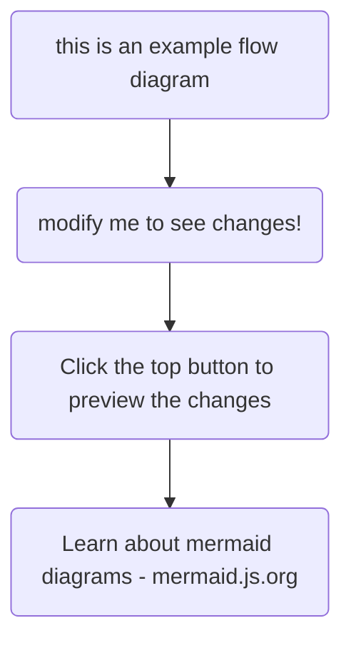

Unser Wohnprojekt befindet sich inmitten einer Wohngegend am Stadtrand von Husum. In unmittelbarer Nachbarschaft gibt es mehrere Mehrfamilien- und Einfamilienhäuser. Familien, Singles, Paare sind in diesem Wohnquartier zu Hause.

Es bestehen alle möglichen nachbarschaftlichen Kontakte, allerdings gibt es (außer einem Spielplatz) keinen wirklichen Treffpunkt, sei es eine Freizeiteinrichtung oder ein Café.

Hier kommt Statthus ins Spiel: die vielseitigen Gemeinschaftsflächen laden geradezu ein, bei Veranstaltungen oder regelmäßigen Gruppen Menschen aus der Umgebung einzubeziehen. Das Netz aus Kontakten, Unterstützung, Interessensgemeinschaften kann so wachsen.

Schon zahlreiche Gruppen und Veranstaltungen haben stattgefunden oder sind in Planung. Allem voran die beliebten Kleidertauschparties.

Folgendes findet demnächst oder fortlaufend statt:

